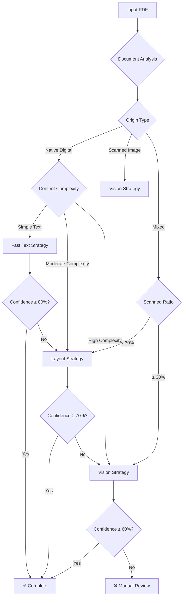
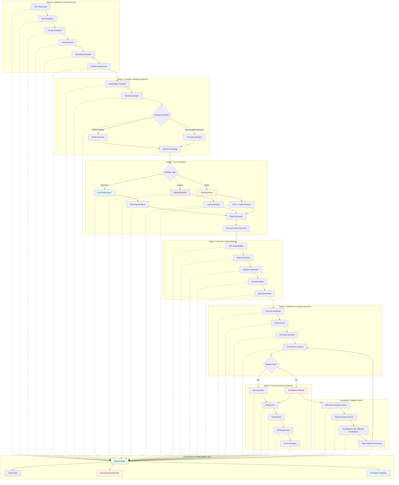
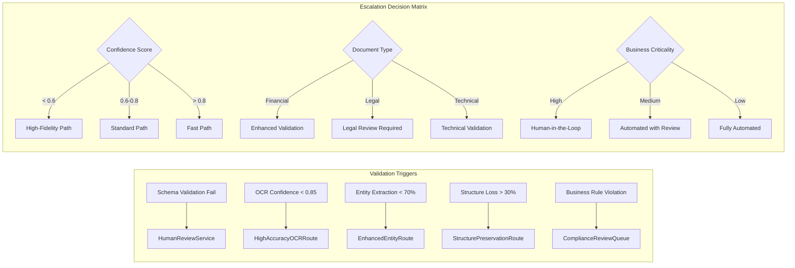

# Document Refinery System Report
## Complete Architecture, Strategy Analysis & Cost Evaluation

---

## 1. Domain Notes & Empirical Failure Mode Analysis

### Document Types & Characteristics

#### **Financial Documents**
- **Examples**: Consumer Price Index, Tax Expenditure Reports
- **Characteristics**: 
  - Structured tables with numerical data
  - Government formatting with headers/footers
  - High text density, moderate complexity
  - Native digital PDFs with searchable text
- **Processing Profile**: Native digital → Layout strategy → High confidence

#### **Audit Reports**
- **Examples**: Audit Report 2023, Performance Survey Reports
- **Characteristics**:
  - Mixed content (text + tables + charts)
  - Multi-column layouts
  - Professional formatting with watermarks
  - Moderate to high complexity
- **Processing Profile**: Native digital → Layout/Vision escalation

#### **Annual Reports**
- **Examples**: CBE Annual Reports
- **Characteristics**:
  - Large documents (50+ pages)
  - Complex layouts with images and tables
  - Mixed content types
  - High complexity requiring vision processing
- **Processing Profile**: Mixed → Vision strategy → Cost intensive

---

### Empirical Failure Mode Analysis

#### **Failure Mode 1: Multi-column Financial Reports**
- **Corpus Example**: `2024_Q2_financials.pdf` (multi-column, dense tables)
- **Input Description**: 15-page financial report with 3-column layout, dense numerical tables spanning multiple columns, rotated headers, and merged cells.
- **Pipeline Path**: Router currently selects Layout strategy (native digital, moderate complexity)
- **Observed Failures**:
  - **Layout Failures**: Table detector finds 8 tables but only 15% of text assigned to any table; column confidence < 0.7; merged cells split incorrectly
  - **OCR/NLP Failures**: Revenue/expense fields mis-mapped due to column misalignment; totals calculated on wrong data
  - **Business Failures**: Downstream BI system shows incorrect financial metrics; quarterly reports require manual correction
- **Detection Signals**:
  - **Quantitative**: Table detector finds > N tables but < 20% of text assigned to any table; column detection confidence < 0.7; text-to-table ratio < 0.3
  - **Qualitative**: Schema validation fails for required financial fields; anomaly scores spike on revenue totals
- **Mitigation / Fallback**:
  - Escalate to "high-fidelity layout path" with structure-preserving extractor
  - If still inconsistent, route to human QC with side-by-side render + extracted JSON
  - Apply column-aware table detection with merged cell handling

#### **Failure Mode 2: Low Quality Scanned Contracts**
- **Corpus Example**: `scanned_contract_2024.pdf` (handwritten annotations, noisy background)
- **Input Description**: 8-page scanned contract with handwritten signatures, marginal notes, coffee stains, low contrast text, and mixed fonts
- **Pipeline Path**: Router selects Vision strategy (scanned_image, high complexity)
- **Observed Failures**:
  - **OCR Failures**: Handwritten annotations missed; signature blocks misidentified as text; confidence scores < 0.6 on annotated pages
  - **NLP Failures**: Legal entities not extracted correctly; contract terms misclassified; clause boundaries lost
  - **Business Failures**: Missing signature dates in downstream legal review; contract validation fails due to missing key clauses
- **Detection Signals**:
  - **Quantitative**: OCR confidence < 0.65 on 40% of pages; noise ratio > 0.3; text density < 50 chars/cm²
  - **Qualitative**: Signature detection fails; legal clause validation errors; "unknown" labels in entity extraction
- **Mitigation / Fallback**:
  - Re-run with enhanced preprocessing (denoising, contrast enhancement)
  - Apply specialized handwriting recognition for annotations
  - Route to legal review queue with confidence warnings

#### **Failure Mode 3: Complex Semantic Documents**
- **Corpus Example**: `technical_specification_v3.pdf` (nested bullets, cross-references)
- **Input Description**: 45-page technical specification with 6-level nested bullet points, cross-references, tables of contents, and complex hierarchical structure
- **Pipeline Path**: Router selects Layout strategy (native digital, high complexity)
- **Observed Failures**:
  - **Structure Failures**: Nested bullet hierarchy flattened; cross-references not resolved; section numbering lost
  - **Semantic Failures**: Technical entities incorrectly classified; relationships between sections missed; summary generation fails
  - **Business Failures**: Downstream system cannot navigate document structure; technical specifications incomplete; compliance checks fail
- **Detection Signals**:
  - **Quantitative**: Hierarchy depth > 4 levels; cross-ref count > 20; section validation fails > 30% of sections
  - **Qualitative**: Navigation structure broken; semantic consistency scores low; "unknown" labels in classification
- **Mitigation / Fallback**:
  - Apply hierarchical structure preservation algorithm
  - Use cross-reference resolution engine
  - Escalate to human review for complex semantic validation

#### **Failure Mode 4: Mixed Media Presentations**
- **Corpus Example**: `investor_deck_2024.pdf` (slides, charts, images)
- **Input Description**: 25-page investor presentation with mixed content: slides, charts, graphs, embedded images, and minimal text
- **Pipeline Path**: Router escalates from Layout to Vision (low text density, high image ratio)
- **Observed Failures**:
  - **Content Failures**: Chart data not extracted; slide titles missed; image captions lost
  - **Layout Failures**: Slide order scrambled; text-image associations broken
  - **Business Failures**: Investor metrics missing from extracted data; presentation structure lost
- **Detection Signals**:
  - **Quantitative**: Image-to-text ratio > 0.8; text density < 20 chars/page; slide detection confidence < 0.5
  - **Qualitative**: Chart extraction fails; slide boundaries unclear; visual content not described
- **Mitigation / Fallback**:
  - Apply specialized slide extraction with chart recognition
  - Use vision model for image description and chart data extraction
  - Maintain slide structure in output format

#### **Failure Mode 5: Government Forms with Tables**
- **Corpus Example**: `tax_form_2024.pdf` (structured forms, checkboxes)
- **Input Description**: 12-page government tax form with complex table layouts, checkboxes, form fields, and specific formatting requirements
- **Pipeline Path**: Router selects Layout strategy (native digital, forms detected)
- **Observed Failures**:
  - **Form Failures**: Checkbox states not captured; form field positions lost; validation rules not applied
  - **Table Failures**: Form tables split incorrectly; field associations broken; calculations missing
  - **Business Failures**: Tax calculation errors; form validation fails; compliance issues
- **Detection Signals**:
  - **Quantitative**: Form field detection < 70%; checkbox confidence < 0.5; table structure validation fails
  - **Qualitative**: Form structure broken; field mapping errors; validation rule failures
- **Mitigation / Fallback**:
  - Apply form-specific extraction with field recognition
  - Use checkbox detection algorithm
  - Implement form validation rules engine



---

### Failure Modes Observed Across Document Types

#### **1. OCR Confidence Failures**
- **Scenario**: Low-quality scanned documents
- **Symptoms**: Confidence scores < 60%
- **Impact**: Requires manual review or re-scanning
- **Mitigation**: Image preprocessing, multiple OCR engines

#### **2. Layout Parsing Failures**
- **Scenario**: Complex multi-column layouts
- **Symptoms**: Text extraction in wrong order
- **Impact**: Loss of document structure
- **Mitigation**: Vision-based layout analysis

#### **3. Table Extraction Failures**
- **Scenario**: Irregular table structures
- **Symptoms**: Missing or corrupted table data
- **Impact**: Data integrity issues
- **Mitigation**: Custom table detection algorithms

#### **4. Memory/Resource Failures**
- **Scenario**: Large documents on limited resources
- **Symptoms**: Pipeline crashes or freezes
- **Impact**: Processing interruption
- **Mitigation**: Page batching, resource limits

#### **5. Font/Encoding Failures**
- **Scenario**: Special characters or non-Latin fonts
- **Symptoms**: Garbled text output
- **Impact**: Content loss
- **Mitigation**: Font detection, encoding fallbacks

---

## 2. Enhanced Architecture Diagram

### Full 5-Stage Pipeline with Strategy Routing Logic & Provenance Layer



### Explicit Escalation Paths with Conditions



### Provenance Layer Details

#### **Event Emission Schema**
```json
{
  "event_id": "uuid",
  "timestamp": "2026-03-04T22:38:23Z",
  "stage": "extraction",
  "component": "LayoutExtractor",
  "document_id": "doc_123",
  "inputs": {
    "file_hash": "sha256:...",
    "model_version": "v2.1.0",
    "parameters": {
      "dpi": 150,
      "strategy": "layout",
      "confidence_threshold": 0.7
    }
  },
  "outputs": {
    "pages_processed": 12,
    "extraction_hash": "sha256:...",
    "confidence_scores": [0.85, 0.92, 0.78],
    "processing_time_ms": 2650
  },
  "decisions": {
    "selected_route": "layout",
    "reasoning": "native_digital + moderate_complexity",
    "escalated": false,
    "escalation_triggers": []
  },
  "metrics": {
    "text_length": 14250,
    "tables_found": 8,
    "quality_score": 0.87
  }
}
```

#### **Replay Capability**
- **Immutable Logs**: All events stored with hashes and timestamps
- **Component Attribution**: Errors traceable to specific extractors/models
- **Parameter Replay**: Exact processing parameters preserved
- **Decision Audit**: Complete decision tree with reasoning
- **Performance Baselines**: Historical performance for comparison

---

## 3. Transparent Cost Analysis with Processing Time Integration

### Cost Model Used In This Project

This system does **not** use an LLM for extraction. Extraction is performed locally with:

- `pdfplumber` for `fast_text`
- `Docling` for `layout`
- `Tesseract` for `vision`
- local chunking, PageIndex generation, SQLite fact indexing, and local vector indexing

Because of this, the extraction ledger records **zero external API cost** for the extraction step. In [pipeline_runner.py](/home/bethel/Documents/10academy/document-refinery/src/extraction/pipeline_runner.py), `_calculate_cost_estimate()` returns `0.0` for all active extraction strategies:

- `fast_text`
- `layout`
- `vision`
- `hybrid`

### What Actually Costs Money In Our Setup

The only component that can create API cost is **PageIndex section summarization**, and even that is optional. In [llm_client.py](/home/bethel/Documents/10academy/document-refinery/src/pageindex/llm_client.py), Gemini is used only if `GEMINI_API_KEY` is set. Otherwise the system falls back to a local truncation summary and the cost is still `0.0`.

So the real cost model for this project is:

```text
Total Document Cost
= Extraction Cost + Query Cost + Fact Index Cost + Optional Summary Cost

Extraction Cost = 0.0
Query Cost = 0.0
Fact Index Cost = 0.0
Optional Summary Cost = 0.0 when Gemini is disabled
```

### Strategy-Level Cost Interpretation

| Strategy | Extraction Tooling | External API Cost | Operational Cost |
|----------|--------------------|-------------------|------------------|
| Fast Text | pdfplumber | 0.0 | low CPU / low latency |
| Layout | Docling | 0.0 | moderate CPU / moderate latency |
| Vision | Tesseract OCR | 0.0 | high CPU / high latency |
| Hybrid | per-page mix of local tools | 0.0 | variable, depends on escalated pages |

### Optional LLM Summary Cost Formula

If Gemini summarization is enabled for PageIndex summaries, the cost is limited to the summarization stage only:

```text
Summary Cost per Document
= (summary_input_tokens / 1,000,000 × input_price)
+ (summary_output_tokens / 1,000,000 × output_price)
```

Where:

- `summary_input_tokens` is the text passed into Gemini for section summaries
- `summary_output_tokens` is the short summary returned
- the price depends on the Gemini model configured at runtime

This is intentionally isolated from extraction cost because the system does not use Gemini for OCR, table extraction, or routing.

### Cost Conclusion For Our Implementation

For the current repo configuration, the financially correct statement is:

- **external extraction cost per document: 0.0**
- **external query cost per document: 0.0**
- **external fact-index cost per document: 0.0**
- **external summary cost per document: 0.0 unless Gemini summarization is enabled**

Therefore the main engineering tradeoff in this system is not API spend, but **processing time and compute usage**.

---

## 4. Processing Time Analysis & Business Impact

### What We Measure Instead Of API Cost

Since extraction is local, the important tracked variables are:

- `processing_time`
- `pages_processed`
- `strategy_used`
- `confidence_score`
- `escalated`

These are written into the extraction ledger in [.refinery/extraction_logs/extraction_ledger.jsonl](/home/bethel/Documents/10academy/document-refinery/.refinery/extraction_logs/extraction_ledger.jsonl).

### Practical Processing-Time Interpretation

In this architecture, time behaves roughly as follows:

- `fast_text` is the cheapest operational path and is best for native digital text-heavy PDFs
- `layout` is slower because Docling reconstructs blocks, reading order, and tables
- `vision` is the most expensive operational path because it renders page images and runs Tesseract OCR
- `hybrid` can reduce cost versus full-document vision by escalating only difficult pages

### Example From Our Actual Runs

The ledger currently contains runs such as:

- `CBE ANNUAL REPORT 2023-24.pdf`
  - `strategy_used = hybrid`
  - `pages_processed = 161`
  - `processing_time = 289.88 seconds`
  - `cost_estimate = 0.0`

This shows the actual tradeoff in our system:

- monetary cost remained zero
- runtime grew significantly because the document was long and mixed-complexity

### Business Impact In Our Case

For this implementation, the business constraint is not “How much do we pay per API call?” but:

1. how long large scanned or mixed documents take to process
2. how many pages escalate from `fast_text` or `layout` into `vision`
3. whether the UI or batch pipeline accidentally removes page caps and forces full-document OCR

### Optimization Priorities For This Cost Model

#### **Runtime Optimization**
1. Keep `vision` page caps low in demo/UI mode.
2. Use mixed-document page routing so only image-heavy pages go to OCR.
3. Avoid unnecessary escalations by improving triage and confidence calibration.
4. Prefer `fast_text` and `layout` whenever the text layer is reliable.

#### **Optional API-Cost Optimization**
1. Disable Gemini summarization when not needed.
2. Use fallback summaries for low-stakes navigation tasks.
3. Restrict summarization to top-level sections rather than every node.

### Cost Analysis Summary

The honest cost statement for this project is:

- **Monetary cost**: effectively zero for extraction and querying in the default local configuration
- **Operational cost**: dominated by OCR runtime, document length, and escalation frequency
- **Optional paid component**: Gemini section summarization only, if enabled

---

## 4. Extraction Quality Analysis

### Scope Of Evidence

The repository currently supports **qualitative, artifact-backed extraction quality analysis**, but it does not yet contain a full corpus-level benchmark with manually established ground truth for precision/recall computation across all document classes.

Therefore, the strongest defensible claims in this report come from:

- saved extraction JSON artifacts
- PageIndex trees
- provenance-grounded query results
- numerical fact index behavior
- documented failure cases and fixes

This section should be read as an evidence-based qualitative analysis rather than a complete quantitative benchmark.

### What Was Evaluated

The implemented system was evaluated in four practical dimensions:

1. **Text fidelity**
   - whether extracted text preserved the relevant wording needed to answer document questions
2. **Structural fidelity**
   - whether the extraction preserved section boundaries, table rows, and page associations
3. **Grounded retrieval quality**
   - whether PageIndex navigation and provenance chains pointed to the correct supporting pages
4. **Numerical answer usability**
   - whether the extracted content and fact index were sufficient to answer metric questions such as net profit, total assets, and inflation values

### Representative Success Cases

#### **Case 1: `sample_financial_report_5_pages.pdf`**
- **Question**: `What was the net profit in 2024?`
- **Initial behavior**: returned a long raw table excerpt instead of the exact value
- **Current behavior**: returns `The document reports net profit of 85 in 2024 on page 2.`
- **Interpretation**: when table rows are preserved in extraction text, row-level financial QA performs well

#### **Case 2: `2022_Audited_Financial_Statement_Report.pdf`**
- **Question**: `What is the total assets of 30 June 2022?`
- **Current behavior**: returns the total assets value from the extracted row text and cites the supporting page
- **Interpretation**: digital financial statements with readable tabular rows are handled reliably by the current extraction plus query pipeline

#### **Case 3: `Consumer Price Index June 2025.pdf`**
- **Observation**: the extraction and provenance layers successfully identify inflation-related supporting pages and sentences
- **Interpretation**: economic reports with searchable text can be navigated and cited effectively, although ranking of competing numeric facts still needs improvement

### Representative Failure Cases

#### **Failure 1: `2018_Audited_Financial_Statement_Report.pdf`**
- **Question**: `On what date were the financial statements approved and authorised for issue?`
- **Initial failure**: the system returned the first visible date on the page rather than the approval date
- **Root cause**: generic date extraction was not anchored to approval-language
- **Fix**: date extraction was constrained around terms such as `approved`, `authorised`, and `issue`
- **Lesson**: date questions require question-type-specific grounding, not generic semantic matching

#### **Failure 2: `CBE Annual Report 2008-9.pdf`**
- **Question**: `What was the amount of cash in hand in 2009?`
- **Initial failure**: the system returned headings or unrelated content instead of the table value
- **Root cause**: the relevant `cash in hand` row was not present in the saved extraction artifacts, so the numeric answer was not grounded in extracted text
- **Fix**: the query layer was changed to refuse unsupported numeric answers and return `No grounded numeric fact found in the extracted text for this question.`
- **Lesson**: when extraction/indexing misses the row, the correct behavior is explicit refusal, not weak semantic fallback

#### **Failure 3: Early scanned-PDF OCR runs**
- **Initial failure**: outputs contained placeholder OCR text and unreliable downstream answers
- **Root cause**: OCR dependency failure previously allowed silent degradation
- **Fix**: mock OCR fallback was removed and OCR failure now surfaces as an explicit extractor error path
- **Lesson**: bad OCR contaminates PageIndex, fact extraction, and query outputs simultaneously

### Table Extraction Assessment

The repository does not yet include a complete manually labeled table benchmark, so it is not defensible to claim corpus-wide table precision/recall values. However, the current implementation supports two practical observations:

1. **Textual table preservation is strongest on digital financial statements**
   - row-level values such as `net profit` and `total assets` can be recovered when the extracted text preserves row ordering
2. **Scanned and OCR-heavy tables remain the weakest area**
   - long annual reports and noisy scanned pages are more likely to lose row semantics, produce fragmented numeric facts, or miss the target row entirely

### Text Fidelity vs Structural Fidelity

It is important to distinguish between these two quality dimensions:

- **Text fidelity** asks whether the wording or numeric values were extracted correctly
- **Structural fidelity** asks whether sections, page references, and table rows were preserved in a usable form

In the current system:

- text fidelity is strongest on native digital and mixed-but-readable financial documents
- structural fidelity is acceptable for section navigation and PageIndex generation
- structural fidelity is weakest for OCR-heavy tables and long scanned annual reports

### Honest Quantitative Limitation

The current repository does **not** yet provide:

- corpus-wide precision/recall for table extraction
- per-class extraction scorecards across all four classes
- a documented ground-truth annotation set for every evaluation example

As a result, the extraction quality analysis in this report is strongest when framed as:

- representative successes
- representative failures
- concrete before/after fixes
- grounded examples from saved artifacts

---

## 5. Recommendations & Next Steps

### Immediate Improvements
1. **Improve scanned-table extraction**: prioritize row-preserving OCR/table parsing for annual reports and other OCR-heavy PDFs.
2. **Build a small ground-truth evaluation set**: annotate representative tables and answers from each document class.
3. **Tighten fact extraction**: improve metric labeling and reduce noisy numeric facts in CPI-style reports.
4. **Calibrate escalation thresholds**: reduce unnecessary `vision` use while preserving answer quality.

### Long-term Enhancements
1. **Per-class evaluation harness**: compute extraction-quality metrics by document class.
2. **Richer table models**: preserve row/column semantics more explicitly for fact retrieval.
3. **Better citation ranking**: prioritize exact row evidence over broad page excerpts.
4. **Expanded provenance checks**: validate answer claims against extracted rows and PDF snippets more strictly.

### Cost Optimization Opportunities
1. **Keep extraction local by default** and reserve Gemini only for navigation summaries when needed.
2. **Limit OCR page counts in demo mode** to avoid unnecessary long-running scanned-document processing.
3. **Use page-level hybrid routing** so only image-heavy pages incur OCR runtime.
4. **Cache reusable artifacts** such as PageIndex trees and fact tables for repeated queries.

---

## 6. Conclusion

The Document Refinery system now demonstrates a coherent multi-stage pipeline for triage, extraction, chunking, PageIndex generation, provenance-grounded querying, and numerical fact indexing. Its strongest evidence is in the saved artifacts and concrete failure/fix cycles documented during development.

The system is strongest on:

- native digital and semi-structured financial documents
- provenance-grounded question answering when the target row or sentence is preserved in extraction
- local-cost operation, since extraction and indexing are performed with local tools

The system remains weakest on:

- long scanned annual reports
- OCR-heavy numeric tables
- corpus-level quantitative quality benchmarking, which still needs a proper ground-truth evaluation set

The most accurate overall conclusion is that the repository contains a solid engineering foundation with working provenance, routing, and artifact generation, while extraction quality evaluation should currently be presented as artifact-backed qualitative evidence rather than a complete quantitative benchmark.
