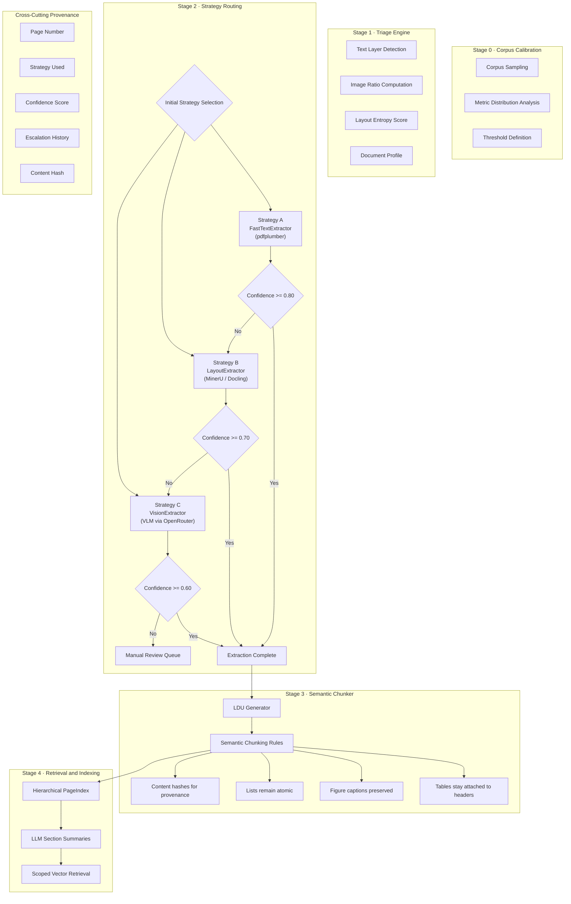

# Document Refinery

A multi-stage document intelligence system:

- Stage 1: Document Triage (classification)
- Stage 2: Multi-strategy extraction with escalation guard
- Stage 3: Semantic chunking (LDUs)
- Stage 4: Hierarchical PageIndex builder
- Stage 5: Query interface agent (navigation + semantic + structured)

## Architecture




## Domain Analysis Subsystems

### Corpus Calibration Lab

The Corpus Calibration Lab analyzes your PDF corpus to generate statistical thresholds for document processing:

**Location**: `src/domain_analysis/calibration/`

**Features**:
- Scans all PDFs in `data/raw/`
- Computes metrics: total_pages, total_chars, avg_chars_per_page, image_area_ratio, detected_table_count, x_cluster_count
- Logs per-document metrics to `.refinery/logs/corpus_metrics.jsonl`
- Generates percentile-based thresholds in `.refinery/rules/extraction_rules.yaml`
- Uses statistical distributions (20th/80th percentile separation) - no hardcoded thresholds

**Usage**:
```bash
python src/domain_analysis/calibration/run_calibration.py
```

### Document Triage Engine

The Document Triage Engine classifies individual documents using calibrated thresholds:

**Location**: `src/domain_analysis/triage/`

**Features**:
- Lightweight classification of single PDFs
- Loads thresholds from `.refinery/rules/extraction_rules.yaml`
- Classifies: origin_type, layout_complexity, language + confidence, domain_hint, estimated_extraction_cost
- Uses Pydantic DocumentProfile model
- Saves profiles to `.refinery/profiles/{doc_id}.json`
- No full extraction - only classification logic

**Usage**:
```bash
python src/domain_analysis/triage/run_triage.py path/to/document.pdf
```

## Installation

```bash
pip install -e .
```

## Project Structure

```
document-refinery/
├── .refinery/
│   ├── profiles/              # DocumentProfile JSON outputs
│   ├── logs/                  # Extraction metrics
│   └── rules/
│       └── extraction_rules.yaml
├── data/
│   ├── raw/                   # Input PDFs
│   └── processed/             # Extracted JSON outputs
├── src/
│   ├── domain_analysis/       # NEW: Corpus calibration and triage
│   │   ├── calibration/        # Corpus analysis lab
│   │   └── triage/           # Document classification engine
│   ├── triage/               # Original triage (legacy)
│   ├── extraction/           # Multi-strategy extraction
│   ├── models/               # Pydantic models
│   ├── chunking/             # LDU chunking engine
│   ├── pageindex/            # Hierarchical indexing
│   ├── query/                # Query interface
│   └── main.py
├── tests/
├── pyproject.toml
└── README.md
```
