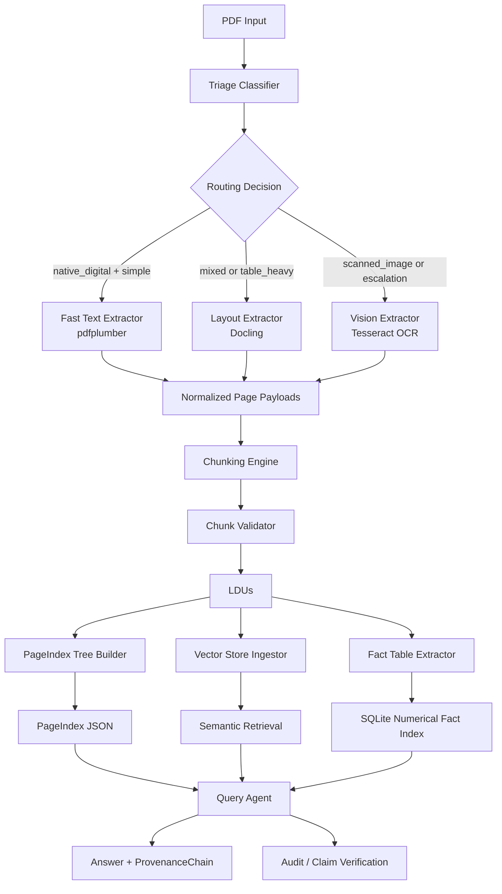

# Document Refinery Report Appendix

## 1. OCR Recall Collapse

### Problem Summary
During iterative testing, the largest extraction-quality failure came from OCR recall collapse on scanned and mixed-origin documents. The system was often retrieving the correct page, but the extracted text on that page was incomplete, placeholder-based, or too noisy to support grounded answers.

### Observed Failure Cases
1. Mock OCR fallback polluted downstream stages.
   Early runs returned strings such as `Mock Tesseract OCR text for scanned page ...` inside extraction outputs, PageIndex summaries, and query answers. This caused the system to look structurally correct while being semantically wrong.
2. OCR dependency failure silently degraded output quality.
   When `pdf2image`, `pytesseract`, Pillow, or the Tesseract binary were unavailable in the active runtime, the extractor previously dropped into mock behavior instead of failing loudly.
3. Query answers copied noisy OCR spans instead of extracting the target fact.
   For example, date and financial-value questions returned long page excerpts rather than the exact approved date, net profit, or total assets value.

### Root Causes
- OCR availability was treated as optional in the vision extractor.
- Downstream components trusted extracted text even when the text was clearly placeholder or low-value.
- Query composition initially relied too heavily on keyword overlap and generic excerpt fallback.

### Fixes Implemented
- Replaced Google Cloud Vision usage with Tesseract-only OCR.
- Removed silent mock-OCR behavior and returned explicit OCR error metadata when dependencies are missing.
- Added schema-complete failure metadata so OCR failures do not crash Pydantic validation.
- Tightened query answering for:
  - approval-date questions
  - page-reference questions
  - financial row questions such as `total assets` and `net profit in 2024`
- Added UI warnings when saved extraction content contains mock OCR text.

### Engineering Lesson
OCR quality is not just an extraction concern. Once weak OCR enters the system, it degrades PageIndex generation, provenance quality, and the final answer layer. The correct mitigation is to fail loudly on OCR unavailability and to gate answers on grounded evidence instead of formatting.

## 2. Cost Analysis: Implementation And Methodology

### Implementation Used In Code
Cost logging is implemented in [pipeline_runner.py](/home/bethel/Documents/10academy/document-refinery/src/extraction/pipeline_runner.py). Each extraction run appends a ledger entry to [.refinery/extraction_logs/extraction_ledger.jsonl](/home/bethel/Documents/10academy/document-refinery/.refinery/extraction_logs/extraction_ledger.jsonl) with:

- `strategy_used`
- `confidence_score`
- `pages_processed`
- `processing_time`
- `cost_estimate`
- `escalated`
- `status`

### Current Cost Rule
The active implementation treats all current local extractors as zero external-cost strategies:

- `fast_text`
- `layout`
- `vision`
- `hybrid`

This is because the current stack uses local tools:

- `pdfplumber` for fast text extraction
- `Docling` for layout-aware extraction
- `Tesseract` for OCR
- local chunking, indexing, and SQLite/FAISS-style indexing

In code, `_calculate_cost_estimate()` currently returns `0.0` for all active strategies.

### Methodology
Although the external API cost is zero, we still model extraction cost operationally through:

- processing time
- number of pages processed
- escalation frequency
- strategy tier used

The reasoning is:

- `fast_text` is cheapest and fastest
- `layout` is medium complexity because it reconstructs layout and tables
- `vision` is highest compute cost because it rasterizes pages and runs OCR
- `hybrid` reduces unnecessary vision cost by routing pages selectively

### Practical Interpretation
For this project:

- monetary cost = `0.0`
- compute/latency cost != `0`

This distinction is important in the report. The system is free to run locally, but not free in time or CPU. That is why the ledger captures `processing_time` and `pages_processed` even when `cost_estimate` is zero.

## 3. System Architecture

### Overview
The current system uses a five-stage pipeline:

1. Triage
2. Extraction
3. Chunking
4. PageIndex and Data Layer indexing
5. Query with Provenance / Audit

### Mermaid Diagram



### Typed Data Flow
- Triage output: `DocumentProfile`
- Extraction output: normalized page payloads plus `extraction_metadata`
- Chunking output: `LDU`
- Page navigation output: PageIndex tree JSON
- Numerical index output: SQLite `facts` rows
- Query output: grounded answer plus `ProvenanceChain`

### Routing Logic In Use
- native digital, simple pages -> `fast_text`
- mixed / table-heavy -> `layout`
- scanned or low-confidence pages -> `vision`
- per-page escalation path -> `fast_text -> layout -> vision`

### Provenance Flow
Provenance is propagated through:

- page number
- bounding box
- LDU id
- content hash
- section reference
- final answer citations

## 4. Numerical Fact Index

### Why It Exists
Many document systems preserve text but fail on numbers. Reports depend heavily on numeric facts such as:

- inflation rate
- revenue
- net profit
- total assets
- month/year-specific metrics

Without a numerical index, queries such as `What was inflation in August?` or `What was the net profit in 2024?` are forced through weak semantic matching.

### Implementation Used
Numerical fact storage is implemented in [fact_table_extractor.py](/home/bethel/Documents/10academy/document-refinery/src/data_layer/fact_table_extractor.py).

Facts are extracted from LDU sentences and inserted into SQLite with fields such as:

- `document_id`
- `ldu_id`
- `section`
- `page_num`
- `metric`
- `value`
- `unit`
- `date`
- `confidence`
- `sentence`
- `content_hash`
- `bbox_json`
- `extraction_date`

### Example Fact Representation

```text
inflation_rate = 13.9%
month = June
country = Ethiopia
```

Stored conceptually as:

```json
{
  "document_id": "cpi_report",
  "metric": "inflation rate",
  "value": 13.9,
  "unit": "%",
  "date": "June",
  "section": "General Inflation",
  "page_num": 5
}
```

### Value Of The Numerical Index
- enables fast fact retrieval
- supports analytics-style queries
- improves grounding for financial and economic questions
- reduces dependence on brittle semantic summarization
- preserves traceability through page number, sentence, and content hash

### Is It Implemented And Actively Used?
Yes.

The system now both:

- stores numerical facts in SQLite during ingestion
- uses those facts at query time through [query_agent.py](/home/bethel/Documents/10academy/document-refinery/src/agents/query_agent.py)

For numerical questions, the query layer now:

- detects a numerical question
- searches the fact index with question-aware keywords
- scores fact rows using metric match, sentence match, and date/month hints
- uses the best fact row to compose the answer when appropriate

This means the numerical fact index is not just an offline artifact. It is part of the live answer path.

### Current Limitation
The numerical index currently uses regex and local context windows, which is effective for many structured rows but still weaker than a dedicated table parser for complex multi-column financial tables. That is why the query layer was additionally extended with row-specific extraction logic for cases like:

- `What was the total assets of 30 June 2022?`
- `What was the net profit in 2024?`

## 5. Report-Ready Summary

The implemented system now combines:

- multi-strategy extraction
- Tesseract OCR for scanned pages
- layout-aware Docling extraction for structured pages
- chunk validation before LDU emission
- PageIndex tree navigation
- provenance-grounded query answering
- SQLite numerical fact indexing

The main engineering lesson is that reliable document QA depends on three linked properties:

- strong extraction
- explicit structure
- grounded answer composition

If any one of these degrades, the final answer quality collapses.

## 6. Failure Cases And Fixes

### Case 1: `2018_Audited_Financial_Statement_Report.pdf`

#### Initial Failure
Question asked:

`On what date were the financial statements approved and authorised for issue?`

The system initially returned the wrong answer by taking the first visible date on the page, such as `30 June 2018`, instead of the approval date.

#### Root Cause
- the query layer used a generic date extractor
- it did not anchor extraction on approval-language such as `approved`, `authorised`, or `issue`
- OCR/page retrieval found the correct page but not the correct local span

#### Fix
- added approval-language-aware date extraction in [query_agent.py](/home/bethel/Documents/10academy/document-refinery/src/agents/query_agent.py)
- narrowed the search window around approval terms before extracting the date

#### Result
The answer path now returns the approval date from the relevant context instead of the first date on the page.

### Case 2: `sample_financial_report_5_pages.pdf`

#### Initial Failure
Question asked:

`What was the net profit in 2024?`

The system initially returned a long raw excerpt:

`Year Revenue Operating Cost Net Profit ... 2024 210 125 85 ...`

instead of the exact answer value.

#### Root Cause
- the query layer did not yet support year-specific row extraction
- even though the extraction text contained the table row, the answer composer fell back to a generic excerpt

#### Fix
- added row-level financial parsing for table-style questions in [query_agent.py](/home/bethel/Documents/10academy/document-refinery/src/agents/query_agent.py)
- added support for `net profit`, `revenue`, and `total assets` questions with year hints

#### Result
The system now answers:

`The document reports net profit of 85 in 2024 on page 2.`

### Case 3: `Consumer Price Index June 2025.pdf`

#### Initial Failure
The numerical fact index existed, but the query path was only using a single guessed topic term. That caused weak retrieval and awkward metric phrasing for inflation questions.

#### Root Cause
- fact lookup searched by one guessed keyword instead of the full question intent
- month and year hints were not being used strongly in fact ranking

#### Fix
- added question-aware fact retrieval in [query_agent.py](/home/bethel/Documents/10academy/document-refinery/src/agents/query_agent.py)
- scoring now uses:
  - metric keyword match
  - sentence keyword match
  - year hint
  - month hint
  - inflation-specific phrase boosts such as `general inflation`

#### Result
The numerical fact index is now part of the live answer path for report-style metric questions, especially CPI and financial metrics.
